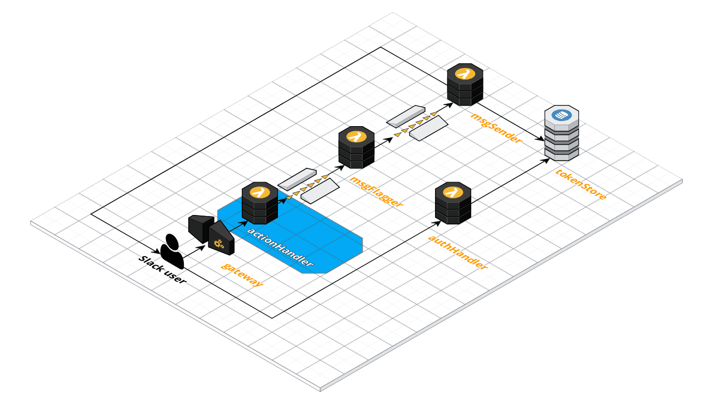

# Action Handler

The role of the Action Handler is to receive message actions from the Slack API, validate they are trusted, and place them onto a queue for processing.

## Documentation

* Slack: [Defining and handling message actions](https://api.slack.com/actions)
* Slack: [Verifying requests from Slack](https://api.slack.com/docs/verifying-requests-from-slack)
* Amazon Simple Queue Service: [Developer Guide](https://docs.aws.amazon.com/AWSSimpleQueueService/latest/SQSDeveloperGuide/welcome.html)

## Functional Overview

* Accept inbound requests from the Slack actions API
* Validate the request signature to ensure message came from Slack
* Reject invalid requests with an appropriate message to the requester
* Determine which message action has been requested
* Place the message action request onto the appropriate queue for processing
* Respond to the requester to indicate the request has been accepted
