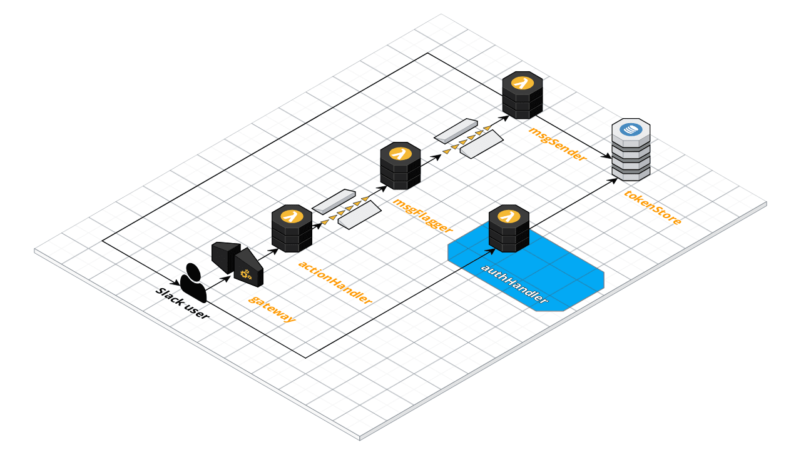

# Auth Handler

The role of the Auth Handler is to allow Slack workspace administrators to install BuddyBot.

## Documentation

* Slack: [Using OAuth 2.0](https://api.slack.com/docs/oauth)
* Amazon DynamoDB: [Developer Guide](https://docs.aws.amazon.com/amazondynamodb/latest/developerguide/Introduction.html)

## Functional Overview

* Provide a page where users can request access to BuddyBot
* Redirect users to Slack to request access
* Accept redirected requests containing temporary auth code
* Use the temporary auth code to request an access token
* Store the access token in DynamoDB
* Let the user know that access has been successfully/unsuccessfully granted
