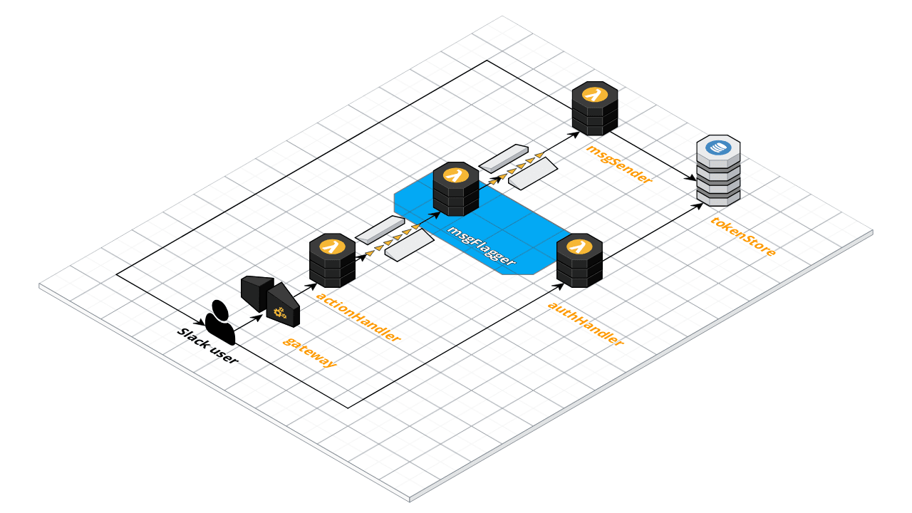

# Message Flagger

The role of the Message Flagger is to receive message action requests from a queue and to flag them for potential code of conduct violation by creating the appropriate messages to be sent to the Slack team, channel and/or user.

## Documentation

* Slack: [Message Guidelines](https://api.slack.com/docs/message-guidelines)
* Amazon Simple Queue Service: [Developer Guide](https://docs.aws.amazon.com/AWSSimpleQueueService/latest/SQSDeveloperGuide/welcome.html)

## Functional Overview

* Read message actions off the inbound flag message queue
* Construct the following messages:
  * Notification to the requester that their request to flag a message has been received
  * Notification to the author of the message that their message has been flagged for a potential code of conduct violation
  * Notification to the "admins" channel with details of the message that has been flagged
* Place each of these messages onto the outbound message queue