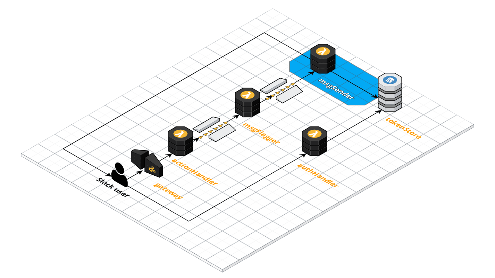

# Message Sender

The role of the Message Sender is to receive messages from a queue and to send them on to the appropriate Slack user, channel, or workspace.

## Documentation

* Slack: [Web API](https://api.slack.com/web#basics)
* Slack: [Methods](https://api.slack.com/methods)
* Slack: [Message Guidelines](https://api.slack.com/docs/message-guidelines)
* Amazon Simple Queue Service: [Developer Guide](https://docs.aws.amazon.com/AWSSimpleQueueService/latest/SQSDeveloperGuide/welcome.html)
* Amazon DynamoDB: [Developer Guide](https://docs.aws.amazon.com/amazondynamodb/latest/developerguide/Introduction.html)

## Functional Overview

* Read messages off a queue
* Determine the destination team, channel and/or user
* Apply any message formatting
* Retrieve the access token for the appropriate team
* Send the message to Slack using the appropriate API method
